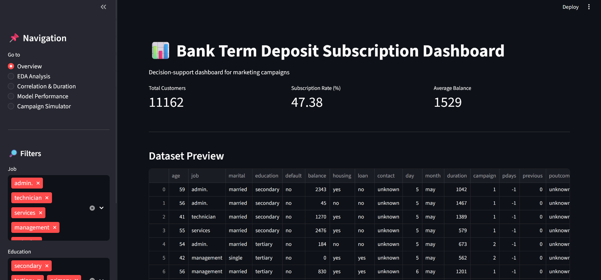
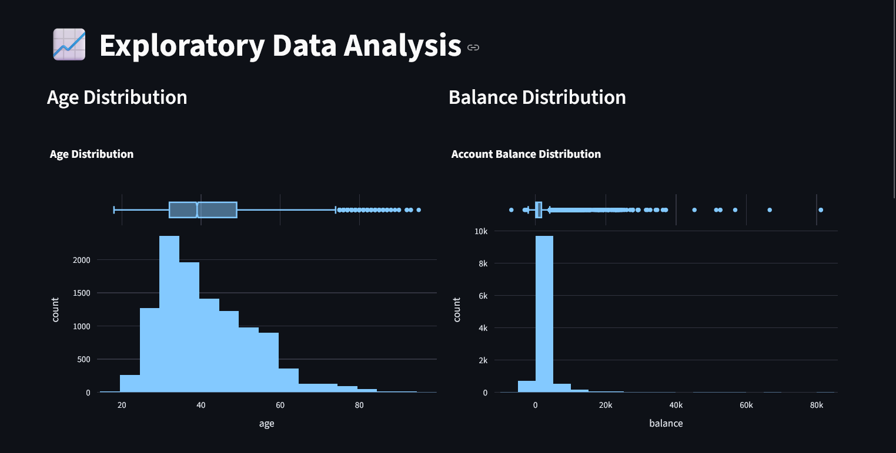
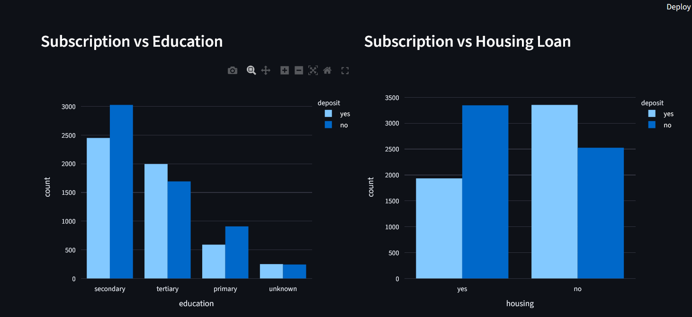
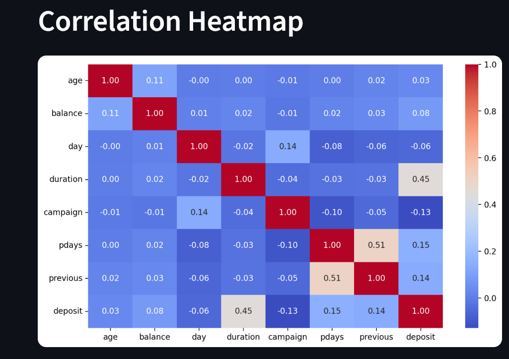
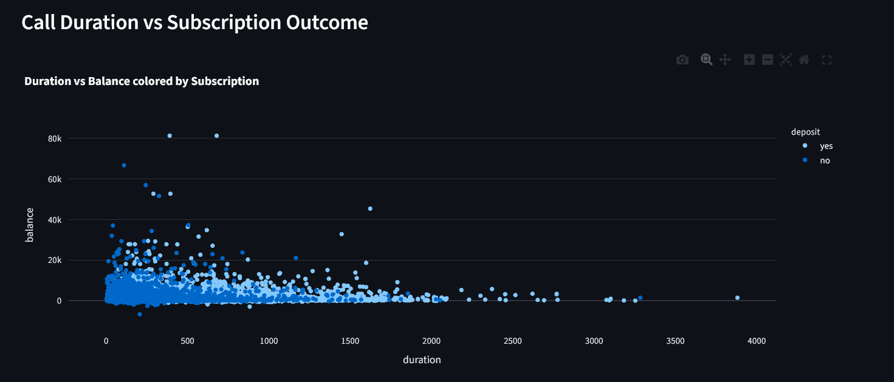
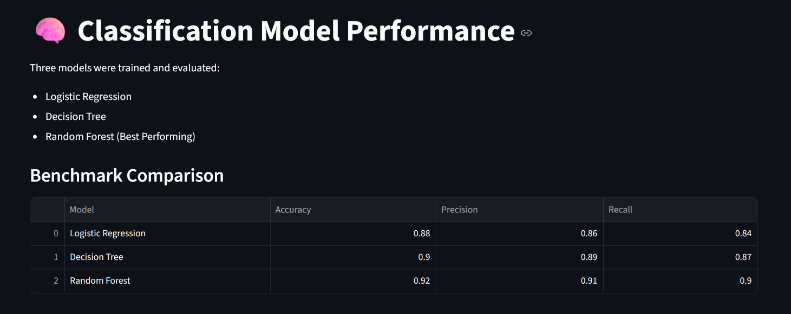
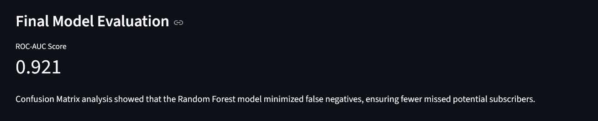
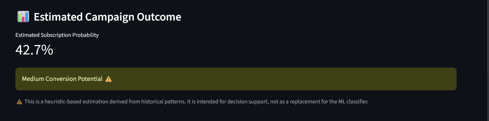

# Bank Subscription Prediction Dashboard

## Project Overview
This project predicts whether a customer will subscribe to a bank term deposit using machine learning models. The system also includes an interactive Streamlit dashboard for exploring insights and simulating marketing campaign strategies.

## Objective
The goal of this project is to help banks improve marketing campaign efficiency by identifying customers who are more likely to subscribe to term deposits.

## Dataset
The dataset used in this project is a bank marketing dataset containing customer demographic and campaign-related attributes.

Key variables include:
- Age
- Job
- Marital status
- Education
- Housing loan
- Personal loan
- Number of campaign contacts
- Previous campaign outcome
- Target variable: Subscription (Yes/No)

## Methodology

### Data Preprocessing
- Data cleaning
- Handling missing values
- Feature encoding
- Feature engineering

### Model Training
Three classification models were implemented:

- Logistic Regression
- Decision Tree
- Random Forest

Random Forest with hyperparameter tuning was selected as the final model.

### Model Evaluation
Model performance was evaluated using:

- Accuracy
- Precision
- Recall
- ROC-AUC Score
- Confusion Matrix

Final ROC-AUC Score achieved: **0.92**

## Dashboard Features

The interactive dashboard was built using **Streamlit** and includes:

- Dataset Overview
- Exploratory Data Analysis
- Correlation Heatmap
- Model Performance Metrics
- What-if Campaign Simulator

### What-if Campaign Simulator
This feature allows users to simulate different marketing scenarios by modifying customer attributes and observing the predicted probability of subscription.

## Tools and Technologies

Programming Language:
- Python

Libraries:
- Pandas
- NumPy
- Scikit-learn
- Plotly
- Matplotlib
- Seaborn
- Streamlit

Development Environment:
- Google Colab
- VS Code

Version Control:
- Git & GitHub
  
## 📊 Dashboard Screenshots

Below are some previews of the interactive Streamlit dashboard built for the Bank Subscription Prediction project.

---

### 🏠 Dashboard Home
This is the main landing page of the dashboard that introduces the project and provides navigation to the analytics and prediction sections.

---

### 📈 Exploratory Data Analysis
This section provides visual insights into the dataset to understand customer behavior and campaign characteristics.

---

### 🔍 Correlation Heatmap
The correlation heatmap helps identify relationships between numerical variables in the dataset and highlights patterns useful for feature analysis.

---

### ⏱ Call Duration vs Subscription
This visualization shows how call duration relates to the likelihood of customer subscription. It helps understand engagement patterns during marketing calls.

---

### 🤖 Model Performance
This section displays the evaluation metrics of the trained machine learning model including accuracy, precision, recall, and ROC-AUC score.

---

### 🎯 What-If Campaign Simulator
The campaign simulator allows users to modify customer attributes and observe how the predicted probability of subscription changes.

---

### 📊 Campaign Subscription Probability
This view shows the predicted probability of a customer subscribing based on the selected campaign parameters.

## Results

The optimized Random Forest model achieved strong predictive performance and provides useful insights for improving marketing campaign strategies.

## Future Improvements

- Deploy the model using a cloud platform
- Integrate real-time prediction APIs
- Expand dashboard analytics features

## Author

Anjani Kavya
Computer Science Student
